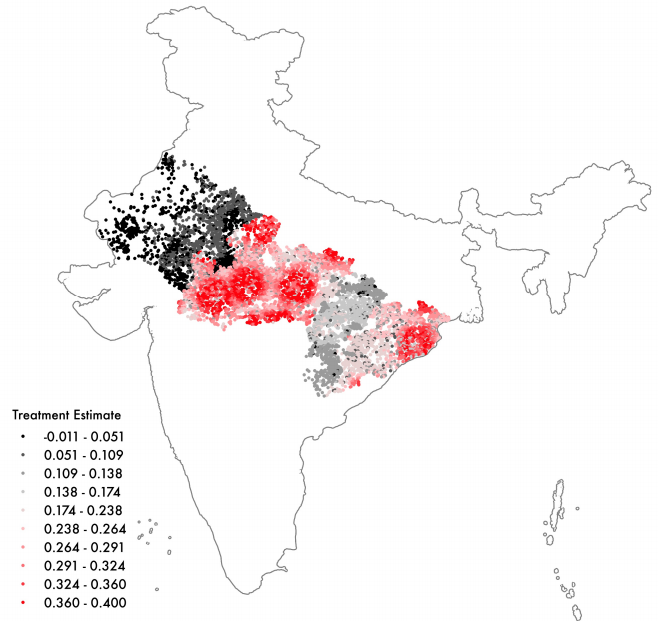

## Welcome

This website contains Java source code related to the Moment Forest estimator from Nekipelov, Novosad, and Ryan (2020). Our goal is to  provide three sets of related source code:

1. Java source code implementing the core moment forest functionality, including bootstrapped standard errors, that works with moment-based objective functions. The goal is that, with minimal effort, researchers can modify these codes to use their own data sets and moment functions.
2. Java and Stata source code linking the moment forest estimator to Stata. This allows for an easy bridge between existing Stata data sets and workflow and the moment forest.
3. Worked examples of several common estimators, including randomized control trials (RCTs), regression discontinuity designs (RDDs), multiple outcomes, linear regression, and logit models.

This website is a work in progress but will be updated regularly.

### The Paper

The paper can be found here \[[PDF](https://bpb-us-w2.wpmucdn.com/sites.wustl.edu/dist/7/3643/files/2024/04/Semiparametric-Project-Slides-2024-5bfa05ddae06dfd4.pdf)\].

### How Does It Work?

The fundamental building block of our estimator is a moment:
\\[
E[Y-m(X;\theta)] = 0,
\\]
where \\( m(X;\theta) \\) is the data-generating process which maps \\( X \\) into \\( Y \\) as a function of the parameter \\( \theta \\). Empirical models specify that relationship and then seek to find a vector of parameters, \\( \theta \\), in order to match the outcomes as closely as possible in some metric.

The primary innovation of the moment forest is to replace that model with the following:
\\[
E[Y-m(X;\theta(Z))] = 0,
\\]
where the parameter vector now depends on the matrix \\( Z \\), which may or may not be a subset of \\( X \\). The moment forest  estimates how the structure of \\( \theta \\) changes with \\( Z \\), allowing for arbitrary observable heterogeneity in parameters. Conditioning on that partitioning of the parameter space, one estimates the parameter \\( \theta \\) as usual through the generalized method of moments.

The basic element of the moment forest is a *moment tree*. Moment trees provide the partioning of parameters with \\( Z \\) and are grown recursively from a base *root* node. At the root node, a universal parameter is fitted to minimize the moment function on all the data. A search is then conducted along each dimension of the matrix \\( Z \\) by splitting the data into two disjoint partitions. A separate moment is fitted within each of those partitions for all possible splits. The moment tree branches along the split point which generates the largest improvement in fit. This process is then repeated recursively until a stopping condition is met. The end result is an assignment of parameters to subsets of \\( Z \\). A moment forest is grown by resampling the data and growing many moment trees. The moment forest returns an estimate of the parameter \\( \theta(Z) \\) by averaging parameters returned by each of constituent trees in the forest.

In our theory, we prove several useful theoretical properties of moment forests. As is well-known in the literature, the trees in our setting are universal approximators, and can recover any \\( \theta(Z) \\), subject to some modest complexity bounds and weak regularity conditions on the moment function. Second, we show consistency and prove uniform convergence, including an associated rate. These results are key for two reasons; uniform convergence allows researchers to conduct statistical tests at different points of \\( Z \\), while the rate of convergence allows our results to be used as plug-in estimators in more complex models.

### Java Source Code

The java source code is contained in two separate folders on the Github repository: [jars and java](https://github.com/cactus911/momentForests) 

Jar files are various helper utilities, and their license information is as follows:

1. [Jama-1.0.3.jar](https://math.nist.gov/javanumerics/jama/) is in the public domain.  
2. [optimization.jar](https://github.com/rwl/optimization) is in the public domain and also available at [http://www1.fpl.fs.fed.us/optimization.html](http://www1.fpl.fs.fed.us/optimization.html).  
3. [itext-1.3.jar](https://sourceforge.net/projects/itext/) is in the public domain.  
4. [jfreechart-1.0.19.jar](https://sourceforge.net/projects/jfreechart/files/1.%20JFreeChart/1.0.19/) is in the public domain.  
5. [jsci-core.jar](http://jsci.sourceforge.net/) is in the public domain.  
6. utility.jar and momentforests.jar are written by us for this project.

### Link to STATA and worked example

We have also developed a link between the functionality contained in the Java code and STATA. 
[STATA interface](./linktostata.md)
