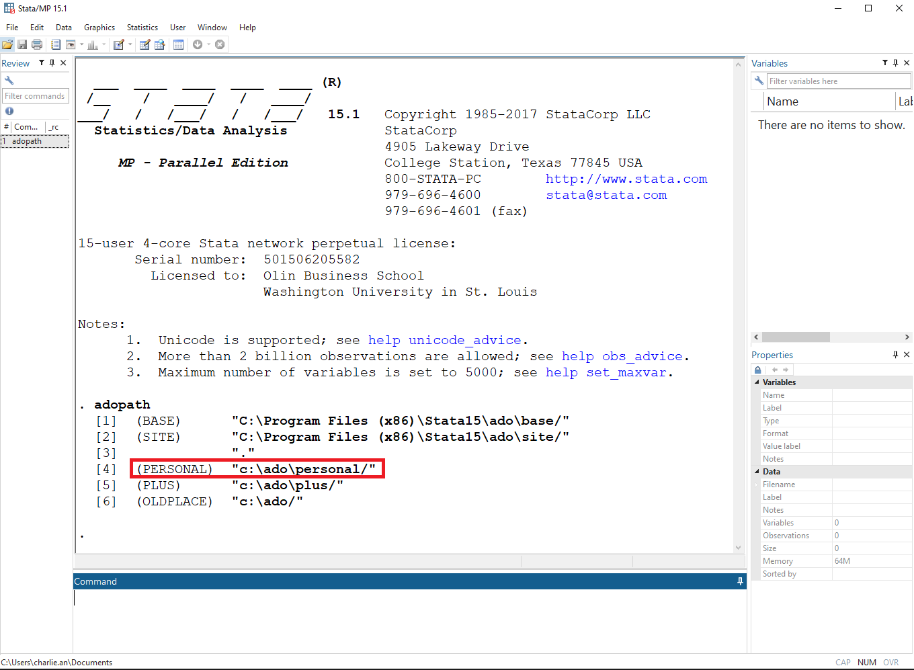

# How to use Moment Forests on Stata

## I. Components

The codes are grouped into two folders: [jars and java] (https://github.com/cactus911/momentForests)

Folder “jars” contains relevant java utilities, the Moment Forests jar file compiled from the Moment Forests java files, and a Stata ado file. 
Folder “java” contains all the java source codes that implement Moment Forests. The common components that can be applied to any appliations are stored in the subdirectory "core", while specific application files including RCT are in the subdirectory "examples".

## II. How to run Moment Forests on Stata

### Step 1/3. Figure out Stata personal directories

The Stata personal directory can be found by typing “adopath” in the Stata command window. The one starts with “(PERSONAL)” is the personal directory. For example, "c:\ado\personal/".

 



### Step 2/3. Download files from the GitHub website.

Download all the files from folder [“jars”](https://github.com/cactus911/momentForests/tree/master/jars) and save them in Stata personal directories. Make sure all 15 files (13 jar files, 1 readme text file, 1 Stata ado file) are properly downloaded and stored.

### Step 3/3.

Close and reopen Stata. Now you are ready use Moment Forests on Stata.

## How to modify the original codes

If a user wants to check how the algorithm is structured or wants to modify it, one needs to look at the original java codes in folder [“java”](https://github.com/cactus911/momentForests/tree/master/java). After making modifications, users should compile them into a jar file “momentforests.jar”. Then, by replacing this jar file in their own Stata personal directory, one can use own version of Moment Forests on Stata.

## Stata command “momentforests” 

Syntax
momentforests depvar treatment indepvars [if] [in] [, options]

For example, 
momentforests y w x1 x2, mink_size(1) bootstrap(300) num_tree(150)

[back](./index.md)

