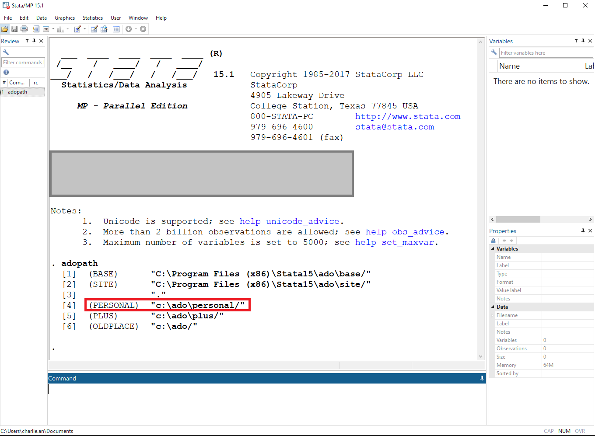
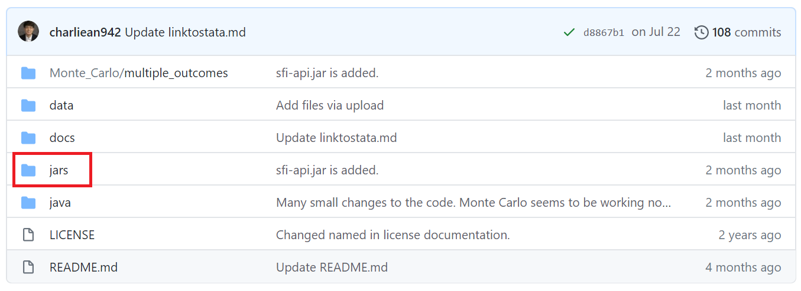

# How to use Moment Forests on Stata

 
## I. Components

The codes are grouped into two directories: [jars and java](https://github.com/cactus911/momentForests)

Folder “jars” contains relevant java utilities, the Moment Forests jar file compiled from the Moment Forests java files, and a Stata ado file. 
Folder “java” contains all the java source codes that implement Moment Forests. The common components that can be applied to any appliations are stored in the subdirectory "core", while specific application files including RCT are in the subdirectory "examples".

 
## II. How to run Moment Forests on Stata

### Step 1/3. Figure out where the Stata personal directories are

The Stata personal directory can be found by typing “adopath” in the Stata command window. The one starts with “(PERSONAL)” is the personal directory. For example, "c:\ado\personal/".

 



### Step 2/3. Download files from the GitHub website.

Download all the files from [“jars”](https://github.com/cactus911/momentForests/tree/master/jars) and save them in the Stata personal directory. Make sure all 15 files (13 jar files, 1 readme text file, 1 Stata ado file) are properly downloaded and stored.

### Step 3/3.

Close then reopen Stata. Now you are ready to use Moment Forests on Stata!

 
## III. Stata command “momentforests”

 
### Title
momentforests - Moment forests
### Description
momentforests performs Moment forests estimation proposed by Nekipelov, Novosad, and Ryan (2020).


### Quick start
Perform Moment forests with all the default values
- momentforests y w x1 x2

Perform Moment forests with 150 trees and 200 times of bootstrapping
- momentforests y w x1 x2, bootstrap(200) num_tree(150)

Perform Moment forests with the optimal minimum observations in each leaf to be 10 and mse improvement level to be 0.001. There is no cross-validation prcoess.
- momentforests y w x1 x2, mink(10) msebar(0.001) cv(0)

Perform Moment forests that searches for the optimal minimum observations in each leaf with cross-validation. It searches from 5 to 100 with the step size 5.
- momentforests y w x1 x2, mink_lower(5) mink_size(5) mink_upper(50)

Perform Moment forests that searches for the optimal mse improvement level with cross-validation. It searches from 0.0001 to 0.0005 with the step size 0.0001.
- momentforests y w x1 x2, msebar_lower(0.0001) msebar_size(0.00005) msebar_upper(0.0001) cv(1)

 
### Syntax
momentforests depvar treatment indepvars [if] [in] [, options]

 

| options | Description |
|:-----------|:------------|
| `num_tree(#)` | number of trees, default = 200 | 
| `bootstrap(#)` | number of bootstrapping for calculating standard errors, default = 100 | 

| options regarding stopping rule hyper-parameters and cross-validation |
|:-----------|:------------|
| `cv(#)` | `0` = do not perform cross-validation for hyper-parameters, `1` = do perform cross-validation for hyper-parameters; default is 1 if either mink(#) or msebar(#) is missing |
| `mink(#)` | minimum number of observations in each leaf when growing trees|
| `mink_lower(#)` | lower bound of the minimum number of observations in each leaf that the algorithm searches from  |
| `mink_upper(#)` | upper bound of the minimum number of observations in each leaf that the algorithm searches from  |
| `mink_size(#)` | the step size that the algorithm uses to search for the optimal minimum number of observations in each leaf  |
| `msebar(#)` | minimum mse improvement when growing trees |
| `msebar_lower(#)` | lower bound of mse imprvoement that the algorithm searches from  |
| `msebar_upper(#)` | upper bound of mse imprvoement that the algorithm searches from  |
| `msebar_size(#)` | the step size that the algorithm uses to search for the optimal mse improvement level  |

 
[back](./index.md)

 
- If a user wants to check how the algorithm is structured, one needs to go through these java codes. 
- If a user wants to modify the codes, one should compile the modified codes into a jar file named “momentforests.jar”. Then, by replacing this jar file in their own Stata personal directory, one can use own version of Moment Forests.

