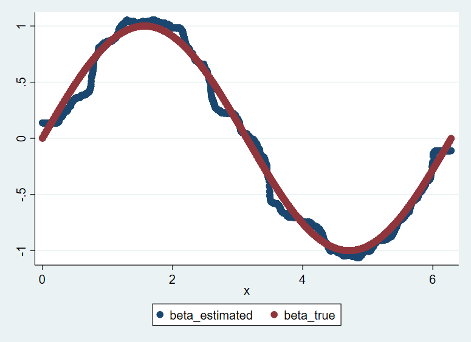

# Worked Examples of Moment Forests

 
## I. Data Generation Process
In order to show the overall performance of the algorithm, we proceeded with three simulations based on different types of parameters.

\\[
Y = W \beta + \epsilon
\\]
where \\( W \\) is a treatment dummy variable and \\( \epsilon \\) follows N(0,1)
 1. discrete case: \\( \beta(x1,x2) = x1 +10*(x2 -1) \\), where \\( x1, x2 = {1,..,10} \\)
 2. continuous case: \\( \beta(x) = sin(x) \\), where \\( x = (0,2 \pi) \\)
 3. hybrid case: \\( \beta(x1,x2) = sin(x1)*(x2 -5) \\), where \\( x1= (0,2 \pi) \\) & \\( x2 = {1,..,10} \\)

 
## II. Monte Carlo Simulation

#### Step 1/4. Download the simulation datasets and Stata do file in [here](https://github.com/cactus911/momentForests/tree/master/Monte_Carlo) to your own working directory.

 
#### Step 2/4. Open Stata and open the Stata do file downloaded (workedexample.do).

 
#### Step 3/4. Set your working directory in the do file. 

For example, `cd "C:\Users\Valued Customer"`

 
#### Step 4/4. Run the rest of the code.

 
## III. Results
The estimation results are reported and plotted below.

### 1/3. Discrete Case: \\( \beta(x1,x2) = x1 +10*(x2 -1) \\)

|  |
|:--:| 
| *Results printed on Stata window* |

|  |
|:--:| 
| *Scatter plot, true beta against estimated beta* |

 
### 2/3. Continuous Case: \\( \beta(x) = sin(x) \\)

|  |
|:--:| 
| *Results printed on Stata window* |

|  |
|:--:| 
| *Scatter plot, x against estimated beta* |

 
### 3/3. Hybrid Case: \\( \beta(x1,x2) = sin(x1)*(x2 -5) \\)

|  |
|:--:| 
| *Results printed on Stata window* |

|  | 
|:--:| 
| *Scatter plot, true beta against estimated beta* |

 
[back](./index.md)

