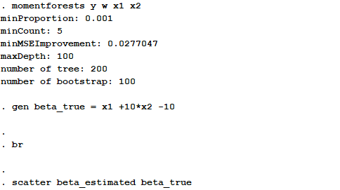

# Worked Examples of Moment Forests

 
## I. Data Generation Process
In order to show the overall performance of the algorithm, we proceeded with three simulations based on different types of parameters.

\\[
Y = X \beta + \epsilon
\\]
where \\( \epsilon \\) follows N(0,1)
 1. discrete case: \\( \beta = x1 +10*(x2 -1) \\), where \\( x1, x2 = {1,..,10} \\)
 2. continuous case: \\( \beta = sin(x) \\), where \\( x = (0,2 \pi) \\)
 3. hybrid case: \\( \beta = sin(x1)*(x2 -5) \\), where \\( x1= (0,2 \pi) \\) & \\( x2 = {1,..,10} \\)

 
## II. Detailed procedures to run Moment Forests on Stata

1. Load the [simulation datasets](https://github.com/cactus911/momentForests/tree/master/Monte_Carlo) to Stata.
2. Proceed with Moment Forests estimation. (see the detailed specification below)
3. Report and plot the simulation results.

 
## III. Results
The estimation results are reported and plotted here. The full estimation results are stored [here](https://github.com/cactus911/momentForests/tree/master/Monte_Carlo)

### 1/3 Discrete Case

 
### 2/3 Continuous Case

 
### 3/3 Hybrid Case

 
[back](./index.md)

